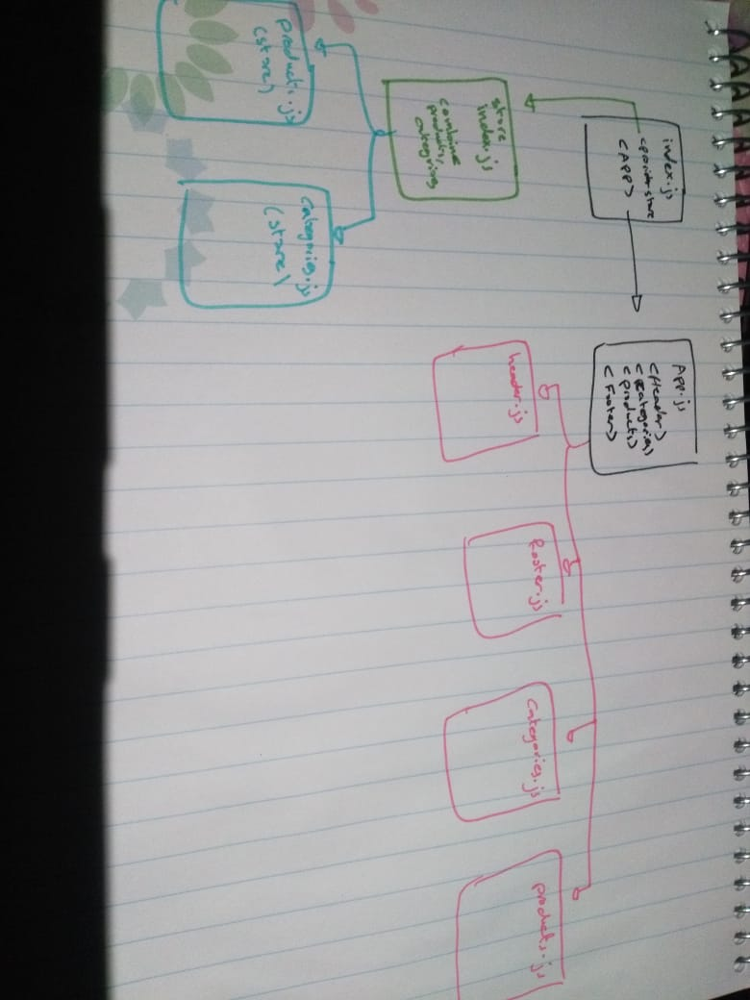

# Store Front 

## Author: Osama Mousa

## Links 
  [LAB-36 PR](https://github.com/401-advanced-javascript-osama/storefront/pull/1)

## How to initialize the application
    `npm run start`
## deplyed url 
[Netlify](https://pedantic-noyce-dfa6cb.netlify.app/)
## Modules
  - Header.js
  - Footer.js
  - Categories.js
  - Products.js
  - App.js
  - Index.js

## UML  
